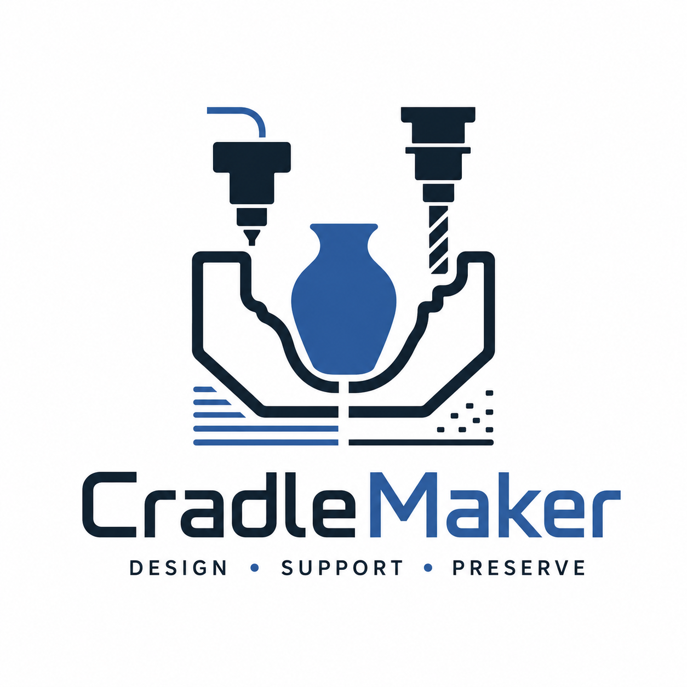

# CradleMaker

<p align="center">
  <a href="https://adamrountrey.github.io/CradleMaker/">
    
  </a>
</p>

CradleMaker is a browser-based tool for designing object-specific supports from
3D scans of museum and cultural heritage objects. It is intended for
conservators, collections staff, preparators, mountmakers, and fabricators who
need a repeatable digital path from an STL model to a handling, storage, study,
treatment, or display cradle.

**Live app:** [Open CradleMaker on GitHub Pages](https://adamrountrey.github.io/CradleMaker/)

CradleMaker supports two fabrication workflows:

| Workflow | Output | Typical use |
| --- | --- | --- |
| 3D-printed cradle | Rigid cradle STL/PLY, optional soft-interface mesh, or connected printable sections | Custom supports with controlled contact, clearance, and structural geometry |
| CNC-carved foam | Single foam-block relief STL or aligned slab STLs with a manifest | Top-side 3-axis carving of Ethafoam or similar conservation foam |

All geometry processing runs in the browser. Imported object files are held in
browser memory and are not uploaded by the static app.

## Museum Object Workflow

1. Create an STL from a 3D scan, photogrammetry model, or other measured digital
   model of the object.
2. Import the STL, inspect it in the 3D workspace, and set the orientation.
3. Choose either `Print cradle` or `CNC foam`.
4. Set contact clearances, fabrication dimensions, and material-specific
   options.
5. Generate and review the cradle using coverage, intersection, mesh, stability,
   and tool-access checks.
6. Export the appropriate STL, PLY, section set, or fabrication manifest.

CradleMaker is a design and verification aid, not a substitute for conservation
judgment or a physical test fit. Confirm scan accuracy, fabrication tolerances,
material suitability, object condition, and contact locations before placing an
object in a finished cradle.

## Object Setup

- Import an STL or load the bundled sample model.
- Rotate the object with an interactive helper and reset the rotation when
  needed.
- Raise or lower the object above the build plane for printed supports.
- Show or hide the object and reference grid.
- View the object as a solid inspection mesh, ghosted context, or hidden geometry
  while reviewing the cradle.
- Navigate the scene with the Three.js orbit camera.

Large meshes use a browser-side mesh BVH for responsive picking, paint tools,
model-intersection checks, and CNC relief sampling.

## 3D-Printed Cradles

The print workflow samples the underside of the imported object and creates a
watertight support structure beneath the selected regions.

### Automatic Support Controls

- Set the overhang threshold angle that defines downward-facing support regions.
- Ignore small overhangs to avoid isolated, low-value contacts.
- Set separate top Z and object XY distances.
- Reserve a support-free band around object edges.
- Choose Low, Medium, or High cradle resolution.
- Add a footprint base plate with adjustable margin and thickness.
- Join uprights at the bottom for a more unified structure.
- Apply an upright taper that widens tall supports toward the base without
  extending full-height material across otherwise empty spaces.

### Resolution Profiles

Each profile pairs a requested sampling size with a bounded grid budget. On very
large models, CradleMaker may automatically use a coarser effective cell size to
remain within the selected memory limit; the QA dashboard reports the actual
resolution used.

| Profile | Target cell size | Grid limit | Intended use |
| --- | ---: | ---: | --- |
| Low | 1.2 mm | 600,000 cells | Faster iteration and broad forms |
| Medium | 0.8 mm | 1.2 million cells | Default balance of detail and memory |
| High | 0.5 mm | 2.4 million cells | Thin features and detailed contact regions |

When a result appears undersampled, the app can recommend the next finer
profile.

### Contact and Interface Options

- Add a separately exportable soft-interface mesh with adjustable top layers
  and spacing. Printing this as a distinct material requires dual extruders or a
  tool changer.
- Leave separate Z and XY foam gaps when the printed structure will receive a
  secondary foam layer.
- Adjust cradle visibility and opacity to compare the generated support with the
  object.

### Manual Coverage Painting

Automatic support regions can be edited directly on the object surface:

- `Needs support` forces coverage in painted areas.
- `No support here` removes coverage from painted areas.
- `Erase paint` removes local edits.
- Brush diameter is adjustable.
- No-support paint can optionally cut through the footprint base plate.

Regenerate the cradle after painting to apply the edited coverage mask.

### Fast and High Accuracy Generation

`Generate cradle` is the fast iteration path. It generates the support, runs
sampled geometry QA, and allows draft export after an explicit warning when High
Accuracy has not been run.

`Generate high accuracy cradle` is the final-fit path:

- Reuses a matching Fast draft when the model and all cradle settings are
  unchanged.
- Evaluates the requested XY and Z clearance continuously rather than relying
  only on sampled surface points.
- Applies target-aware exact Manifold repair only where the draft requires it.
- Uses bounded streaming and localized witness repair to control memory on large
  meshes.
- Requires a final continuous ellipsoidal clearance certificate before marking
  the cradle ready for final export.

Only one cradle generation runs at a time. Stage-aware progress distinguishes
draft generation, target filtering, streamed subtraction, witness repair, and
final certification. `Cancel generation` terminates the active workers and
rejects partial output.

## Review and QA

The print dashboard and detailed status report cover:

- **Coverage:** supported underside cells versus expected contact cells.
- **Mesh:** whether the generated cradle is a solid mesh and the largest sampled
  support gap.
- **Intersections:** sampled cradle points that penetrate the object and the
  largest detected penetration.
- **Stability:** estimated object center-of-mass projection, support polygon
  margin, and tip angle.
- **Resolution:** effective cell size and generated grid dimensions.
- **Clearance:** sampled proximity diagnostics plus the authoritative continuous
  certificate in High Accuracy mode.
- **Runtime:** support-core, worker, filtering, trimming, and certification
  timings for troubleshooting large models.

Coverage markers can be shown directly in the 3D scene. The object and cradle
can each be switched between solid, translucent, and hidden views for close
inspection.

## Splitting a Cradle for Printing

Cradles larger than a printer can be divided into connected sections:

- Select a common build-plate preset or enter custom width, depth, and maximum
  height.
- Reserve a plate margin around every section.
- Adjust connector size and clearance.
- Preview the section layout before export.
- Export one STL per section plus a JSON manifest describing the assembly.

Section cuts use Manifold booleans to create planar solids. Adjacent sections
receive Z-slide dovetail keys and sockets with sloped roofs intended to print
without internal support material. A height-field fallback remains available if
the source cradle cannot be accepted as a Manifold solid.

## CNC-Carved Foam Cradles

The CNC workflow converts the oriented object into a single-sided height-field
relief for top-side 3-axis carving.

### Foam Block and Fit

- Set block width, depth, and height.
- Set the relief sampling resolution.
- Apply separate XY and Z cavity clearances.
- Auto-fit the object height within the block or apply a manual model offset.
- Preview and clear the generated foam relief independently of the print
  workflow.

### Tool Access Checks

- Enter tool stickout and bit diameter.
- Choose a flat end mill or ball nose tool.
- Review whether cavity depth exceeds the available stickout and whether the
  selected tool diameter and end geometry can reach sampled cavity cells.
- Auto-fit height can respond to the selected tool and available block depth.

CradleMaker exports geometry for CAM setup; it does not generate G-code or
ShopBot toolpaths.

### Finger Holes

- Add automatic finger holes around accessible cavity margins.
- Place additional finger holes manually in the preview.
- Set finger-hole diameter and clear existing placements.

Finger holes provide handling access around an object seated in the foam
cavity.

### Multiple Foam Slabs

Deep cradles can be fabricated as aligned layers:

- Enable a multi-slab workflow.
- Set slab count and slab thickness.
- Set dowel diameter and fit clearance.
- Preview the full stack and export each slab in local coordinates.
- Export a JSON manifest with stack order, dimensions, and alignment data.

Disconnected slab islands are evaluated separately. Each retained island must
receive at least two alignment dowels; islands that cannot be aligned safely are
omitted and reported by QA.

## Exports

| Export | Contents |
| --- | --- |
| Cradle STL | Printable rigid cradle mesh |
| Cradle PLY | Rigid cradle mesh for inspection or downstream processing |
| Interface STL/PLY | Optional separately fabricated soft-contact layer |
| Chunk STLs | Build-plate-sized connected print sections |
| Split manifest | JSON section dimensions and assembly information |
| Foam relief STL | Watertight single-block CNC relief/component for CAM import |
| Slab STLs | One local-coordinate mesh per foam layer |
| Slab manifest | JSON stack order, slab dimensions, dowels, and alignment data |

The CNC relief STL can be imported into VCarve as a 3D relief or component.

## Run Locally

Serve the repository root:

```powershell
node cradlemaker-web/server.mjs
```

Then visit:

```text
http://127.0.0.1:5177/cradlemaker-web/
```

The bundled Node server sends the cross-origin isolation headers required for
threaded WebAssembly. Without those headers, the app uses the checked-in serial
support core; cradle geometry and High Accuracy certification remain available.

If the Windows `node` app alias is unavailable, any Python 3 installation can
serve the repository in serial mode:

```powershell
python -m http.server 5177 --bind 127.0.0.1
```

## High Accuracy Diagnostics

The default High Accuracy path uses the target-aware serial Manifold O3 build,
the circumscribed analytic clearance kernel, and adaptive streaming subtraction.
Million-face models begin with 4,000 retained model faces per batch and
automatically halve a failed batch down to 250.

Query parameters retained for diagnostics and rollback:

- `targeted-minkowski=0` uses the bounded global serial repair path.
- `analytic-kernel=0` uses the legacy clearance kernel.
- `targeted-build=size|o3|simd|lto` selects a matched serial build profile.
- `targeted-batch=250..8000` overrides the adaptive initial batch size.
- `manifold-par=1` requests the diagnostic parallel Manifold backend when the
  page is cross-origin isolated.

## Validation

Run the complete geometry and worker suite from the repository root:

```powershell
Get-ChildItem cradlemaker-web/tools/test-*.mjs | Sort-Object Name | ForEach-Object {
  node $_.FullName
  if ($LASTEXITCODE -ne 0) { exit $LASTEXITCODE }
}
```

The suite covers centered-mesh inradius, continuous clearance certification,
the circumscribed kernel, adaptive taper and base containment, worker
certificate integration, target filtering, and differential targeted
Minkowski behavior.

## Build Native Components

The checked-in app includes current serial and threaded WebAssembly support
cores under `cradlemaker-web/src/wasm/`. Rebuild them from the repository root
with:

```powershell
cmd /c cradlemaker-web\wasm\build-wasm.bat
```

The repository also contains the pinned target-aware Manifold patch, matched
build scripts, build-profile manifests, and diagnostic benchmark tools under
`cradlemaker-web/tools/` and `cradlemaker-web/vendor/`.

The support core is CradleMaker-owned code and does not bundle or invoke a
desktop slicer engine.

## Repository Layout

```text
cradlemaker-web/
  index.html              Web app shell
  src/                    Three.js UI, workers, QA, and WASM loader
  src/wasm/               Built serial and threaded support cores
  wasm/                   C++ support-core source and build scripts
  samples/                Bundled sample STL
  tools/                  Tests, benchmarks, and Manifold build scripts
  vendor/                 Browser-side dependencies and Manifold builds
.github/workflows/        GitHub Pages deployment workflow
```

## GitHub Pages

The repository workflow `.github/workflows/cradlemaker-pages.yml` publishes the
contents of `cradlemaker-web/` as a static GitHub Pages site. The bundled sample
STL is included in the Pages artifact.

## Current Limits

- Object import currently accepts STL meshes.
- High Accuracy certifies clearance against the imported digital mesh; it cannot
  correct scan error, printing shrinkage, machining error, or an unsuitable
  user-selected clearance.
- The CNC workflow supports top-side 3-axis relief carving and does not create
  undercut toolpaths, G-code, or ShopBot files.
- Soft-interface printing requires compatible multi-material hardware and
  conservation-appropriate contact materials selected by the user.
- The interface currently exposes the stable `Normal auto` cradle workflow;
  CradleMaker's internal organic-tree path is not currently selectable.
- Generated supports, stability estimates, and tool-access checks must be
  reviewed before fabrication and physically test-fit before object use.

## Terms of Use

CradleMaker is source-available under the
[CradleMaker Terms of Use](TERMS_OF_USE.md). Personal and non-commercial use is
permitted; commercial use requires prior written permission from copyright
holder Adam Rountrey. Third-party components retain their own license terms; see
[Third-Party Notices](THIRD_PARTY_NOTICES.md).
